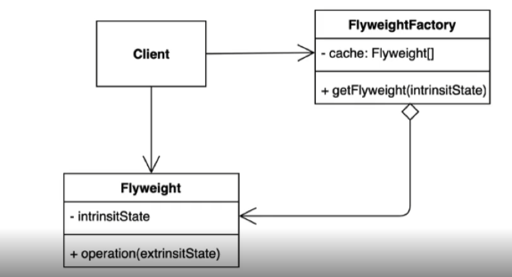

# 아이템 1 - 완전 공략

## 열거타입
* 상수 목록을 담을 수 있는 데이터 타입이다
* 특정한 변수가 가질 수 있는 값을 제한 가능하며 타입 세이프티를 보장 가능하다
* 싱글톤 패턴을 구현할 때 사용하기도 한다
* Map 이나 Set 을 구현 시 키값이 Enum 타입이라면 EnumMap 이나 EnumSet 을 사용하는게 성능적으로 유리하다

## 플라이웨이트 패턴

* 객체를 재사용하는 방법 중 하나
* 객체를 가볍게 만들어서 메모리 사용을 줄이는 패턴이다
* 자주 변하는 속성과 변하지 않는 속성을 분리하고 재사용하여 메모리 사용을 줄인다

## 인터페이스에 정적 메소드
* 자바 8과 9에서 주요 인터페이스의 변화
* 기본 메서드(default method)와 정적 메소드를 가질 수 있다
* 기본 메서드
  * 인터페이스에서 모세드 선언 뿐 아니라 기본적인 구현체도 제공 가능해졌다
  * 기존의 인터페이스를 구현하는 클래스에새로운 기능을 추가 가능하다
* 정적 메서드
  * 자바 9 부터 private static 메소드도 가질 수 있다
  * 단 private 필드는 아직 선언 불가능하다