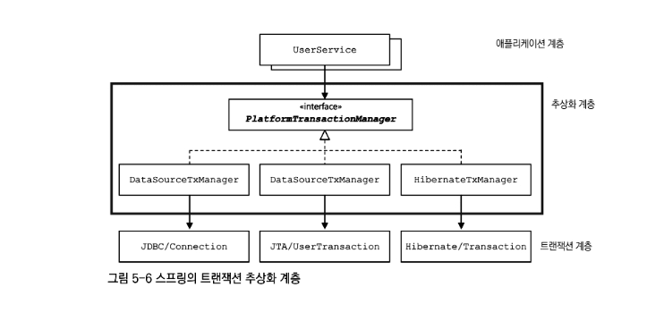

# 아이템 1
## 완전 공략

### 열거타입
* 상수 목록을 담을 수 있는 데이터 타입이다
* 특정한 변수가 가질 수 있는 값을 제한 가능하며 타입 세이프티를 보장 가능하다
* 싱글톤 패턴을 구현할 때 사용하기도 한다
* Map 이나 Set 을 구현 시 키값이 Enum 타입이라면 EnumMap 이나 EnumSet 을 사용하는게 성능적으로 유리하다

### 플라이웨이트 패턴

* 객체를 재사용하는 방법 중 하나
* 객체를 가볍게 만들어서 메모리 사용을 줄이는 패턴이다
* 자주 변하는 속성과 변하지 않는 속성을 분리하고 재사용하여 메모리 사용을 줄인다

### 인터페이스에 정적 메소드
* 자바 8과 9에서 주요 인터페이스의 변화
* 기본 메서드(default method)와 정적 메소드를 가질 수 있다
* 기본 메서드
  * 인터페이스에서 모세드 선언 뿐 아니라 기본적인 구현체도 제공 가능해졌다
  * 기존의 인터페이스를 구현하는 클래스에새로운 기능을 추가 가능하다
* 정적 메서드
  * 자바 9 부터 private static 메소드도 가질 수 있다
  * 단 private 필드는 아직 선언 불가능하다

### 서비스 제공자 프레임워크 (SPI)
* 확장 가능한 애플리케이션을 만들때 사용
* 주요 구성 요소
  * 서비스 제공자 프레임워크 (SPI) 와 서비스 제공자(서비스 구현체)
  * 서비스 제공자 등록 API (서비스 인터페이스의 구현체를 등록하는 방법)
  * 서비스 접근 API (서비스의 클라이언트가 서비스 인터페이스의 인스턴스를 가져올 때 사용하는 API)
    * ServiceLoader -> 서비스 접근 API (서로 영향을 주지 않게 설계)
    * 서비스 제공자 (구현체 -> 외부 jar 가 될 수도 있음)
* 다양한 변형
  * 브릿지 패턴
    * 브릿지 패턴을 공부하다 보면 PSA 까지 연결이 된다
    * Portable Service Abstraction
      * 대표적인 OCP 의 예시 
      * 추상화 계층을 추가해 서비스를 추상화하고 여러 서비스를 비즈니스 로직을 수정하지 않고 교체 가능할 수 있도록 하는 것
      * 서비스를 추상화 함으로써 개발자가 실제 구현을 알지 못해도 해당 기능을 사용 가능
      * 해당 추상화 계층을 구현하는 또 다른 서비스로 쉽게 교체가 가능함
      * @Transactional, @Cacheable 등...
      * 
  * 의존 객체 주입 프레임워크
  * java.util.ServiceLoader