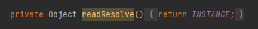
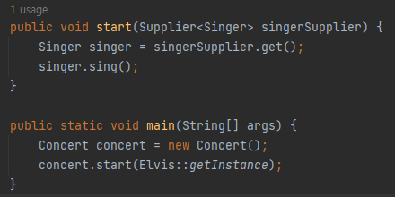

# 아이템 3 생성자나 열거 타입으로 싱글턴임을 보장하라
## 핵심 정리
### private 생성자 + public static final 필드
* 장점
  * 코드가 간결하며 싱글턴 여부를 API 에 알려줄 수 있다
    * java doc 을 만드는 경우 잘 나타남
* 단점
  * 싱글톤을 사용하는 클라이언트가 테스트하기 어려워진다
    * 테스트 코드에서 해당 싱글톤을 사용하는 인스턴스를 가짜로 주입하기가 어려워짐
    * 인터페이스가 있어야 해당 코드에 대한 Mocking 이 가능해지며 테스트가 용이해진다
  * 리플렉션으로 private 생성자를 호출 할 수 있다
    * 리플렉션으로 싱글톤을 깨고 인스턴스를 여러개 생성이 가능
    * 생성자 호출시 기존에 인스턴스가 존재한다면 예외 출력을 권장
      * 하지만 코드가 간결해지지 않음
  * 역직렬화 하는 경우 새로운 인스턴스가 생길 수 있다
    * 
    * 해당 코드를 직접 구현해서 싱글톤에서 사용할 인스턴스를 넘겨줘야 역직렬화시 싱글톤이 보장된다

### private 생성자 + 정적 팩터리 메서드
* 장점
  * API 변경 없이 싱글턴이 아니게 변경 가능하다
    * 메서드를 통해서 접근하기 때문에 클라이언트 코드의 변경 없이 내부 구현을 변경 가능 
  * 정적 팩터리를 제네릭 싱글턴 팩터리로 만들 수 있다
    * 제네릭 싱글톤 팩터리를 사용하면 원하는 타입으로 변환해서 인스턴스를 만들 수 있다
      * 타입을 다르게 생성하면 같은 인스턴스지만 인스턴스끼리 비교할 수 없다
  * 정적 팩터리의 메서드 참조를 공급자(Supplier)로 사용할 수 있다
    * Supplier : Java8 의 함수형 인터페이스
    * 
* 단점
  * private 생성자 + public static final 필드의 단점과 동일하다