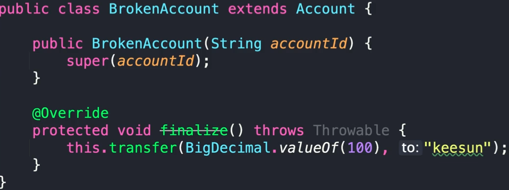

# 아이템 8 finalizer 와 cleaner 사용을 피하라
## 핵심 정리
* finalizer 와 cleaner 는 즉시 수행된다는 보장이 없다
* finalizer 와 cleaner 는 실행되지 않을 수도 있다
* finalizer 동작 중 예외가 발생하면 정리 작업이 처리되지 않을 수도 있다
* finalizer 와 cleaner 는 심각한 성능 문제가 있다
* finalizer 는 보안 문제가 있다
* 반납할 자원이 있는 클래스는 AutoCloseable 을 구현
  * 클라이언트에서 close() 호출 또는 try-with-resource 를 사용하는게 좋다
* cleaner 는 혹시나 try-with-resource 를 안쓰더라도 GC 가 되는 경우 자동으로 종료 되도록 안전장치로 사용하자

## 완벽 공략
### 정적이 아닌 중첩 클래스는 자동으로 바깥 객체의 참조를 가진다
* 중첩 클래스는 static 클래스로 만들자 
* 람다 역시 바깥 객체의 참조를 가지기 쉽다
  * 바깥의 변수 등을 참조 하는 경우에 생긴다

### Finalizer 공격
* 만들다 만 객체를 finalize 메소드에서 사용하는 방법
* Finalizer 공격 
  * 
* 방어하는 방법
  * final 클래스로 생성
  * finalizer() 메소드를 오버라이딩 후 final 을 붙여서 하위 클래스에서 오버라이딩을 막는다

### AutoClosable
* try-with-resource 를 지원하는 인터페이스
* void close() throws Exception
  * 인터페이스에 정의된 메서드에서 Exception 타입으로 예외를 던진다
    * 실제 구현체에서는 구체적인 예외를 던지는것을 추천한다
  * 가능하다면 예외도 던지지 않는 방법도 좋다
    * 예외를 던지지 않고 해당 메서드 안에서 처리
* Closeable 클래스와 차이점
  * IOException 을 던진다
  * 가급적이면 몇번을 실행해도 상관 없이 같은 결과가 반환되어야 한다
    * 멱등성(idempotent)을 지키면 좋다
