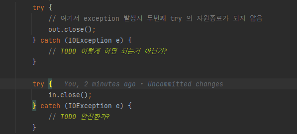

# 아이템 9 try-finally 보다 try-with-resources 를 사용하라
## 핵심 정리
* try-finally 는 java7 부터 더이상 최선의 방법이 아니다
* try-with-resources 를 사용하면 코드가 더 짧고 분명하다
  * 중첩되는 자원에 대한 관리도 훨씬 깔끔하게 처리 가능하다
* 만들어지는 예외 정보도 훨씬 유용하다
    * try-finally 에서는 단순하게 작성 해서는 가장 마지막에 발생한 예외가 보이게 된다
    * try-with-resources 를 사용하면 첫번째 예외가 먹히지 않고 모든 예외가 출력된다

## 완벽 공략
* 자바 퍼즐러 예외 처리 코드의 실수
  * 자바 퍼즐러는 책이름
  * 
* try-with-resources 바이트 코드
  * 컴파일시 중첩된 try catch 로 변환해서 처리해준다
