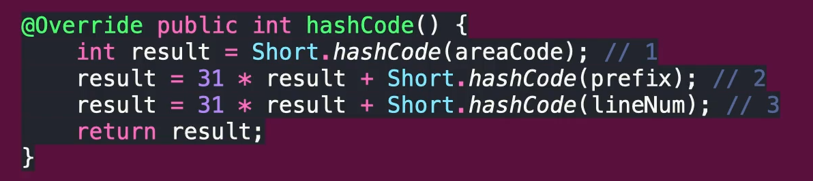
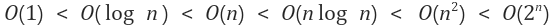

# 아이템 11 equals 를 재정의 하려거든 hashCode 도 재정의 하라
## 핵심 정리
### hashCode 규약
* equals 비교에 사용하는 정보가 변경되지 않았다면 hashCode 는 매번 같은 값을 반환해야 한다
  * 변경되거나 애플리케이션을 다시 실행했다면 hashCode 값이 달라질 수 있다
* 두 객체에 대한 equals 가 같다면 hashCode 의 값도 같아야 한다
* 두 객체에 대한 equals 가 다르더라도 hashCode 의 값은 같을 수 있지만 해시 테이블 성능을 고려해 다른 값을 리턴하는게 좋다
  * 해시 충돌(hashCode 값이 같은 경우)이 발생할 수 있다
  * 성능 저하가 일어나는 이유
    * hash 저장소에서 hash 값을 통해서 꺼내기 때문에 index 를 통해서 꺼내는 것 처럼 빠르다
    * 하지만 중복이 발생하면 해당 hashCode 에 대한 모든 값을 꺼내보기 때문에 LinkedList 에서 값을 찾는 것 처럼 비효율 적으로 변한다
* equals 와 hashCode 를 같이 재정의 하는 이유
  * hash 값을 사용하는 Collection 을 사용할 때 문제가 발생한다
  * hash 자료 구조에서는 hashCode 를 먼저 비교하고 결과가 같다면 equals 를 비교하기 때문 

### hashCode 구현 방법

* 31 사용하는 이유는 예전 개발자들이 31이라는 소수를 썻을때 hash collision 이 가장 적게 일어났다는 연구 결과 때문
  * 지금은 관습처럼 사용한다
1. 핵심 필드 하나의 값의 해쉬값을 계산해서 result 값을 초기화 한다
2. 기본 타입은 Type.hashCode
   * 참조 타입은 해당 필드의 hashCode
   * 배열은 모든 원소를 재귀적으로 위의 로직을 적용하거나, Arrays.hashCode
   * result = 31 * result + 해당 필드의 hashCode 계산값
3. result 를 리턴한다
* 주의사항
  * 만약 지연 초기화를 사용한다면 쓰레드 안정성도 고려해야 한다
  * 성능 때문에 핵심적인 필드를 해시코드 계산시 제외하면 안된다
  * 해시코드 계산 규칙을 API 에 노출하지 말자

## 완벽 공략
### 해시맵 내부의 연결리스트
* 내부 구현은 언제든 바뀔 수도 있다
* java8 에서 해시 충돌 시 성능 개선
  * 내부적으로 동일한 버켓에 일정 개수 이상의 엔트리가 추가되면 연결 리스트 대신 이진 트리를 사용하도록 바뀌었다
  * 연결 리스트에서 어떤 값을 찾을때는 O(n)
  * 이진 트리에서 어떤 값을 찾는때는 O(log n)
* 

### 스레드 안전 (Thread-safety)
* 멀티 스레드 환경에서 안전한 코드
* 가장 안전한 방법은 여러 스레드 간에 공유하는 데이터가 없는 것이다
* 공유하는 데이터가 있다면 사용하는 방법
  * Synchronization
  * ThreadLocal
    * 메서드 스택과 상관 없이 쓰레드 영역에 변수를 설정할 수 있기 때문에 한 쓰레드 내에서 공유할 수 있다
    * 특정 쓰레드가 실행하는 모든 코드에서 해당 쓰레드에 설정된 변수 값을 사용한다
  * 불변 객체 사용
    * 불변 객체 자체는 변경이 되지 않기 때문에 멀티 쓰레드에서 안전하다
  * Synchronized 데이터 사용
    * Lock 을 걸어서 사용하는 가장 쉽고 간편하게 스레드 안정성을 보장하는 방법이다
    * volatile 과 같이 사용해서 더블 체크드 라킹이 가능하다
      * cpu cache 에 저장된 데이터가 아닌 메인메모리에 저장된 데이터를 가져올 수 있게 된다
      * 즉 다른 스레드에 의해 변경된 가장 최신의 데이터를 가져올 수 있다
  * Concurrent 데이터 사용
    * 기본적으로 쓰레드에 안전하며 동시에 여러 쓰레드에서 접근이 가능하게 허용된 자료구조들이다
    * Compare And Swap 알고리즘을 사용해서 동기화를 적용하기 때문에 따로 Lock 을 사용하지 않는다
      * 변수의 값을 확인 시 현재 쓰레드의 데이터를 실제 메모리에 저장된 데이터와 비교해서 두 값이 일치해야 해당 값을 사용 가능하다
      * 만약 연산중에 쓰레드의 값과 메모리의 값이 다른 경우 중간에 다른 작업이 있던것으로 판단 write 을 중단 후 작업을 재시도 한다
  * 기타 등등..
